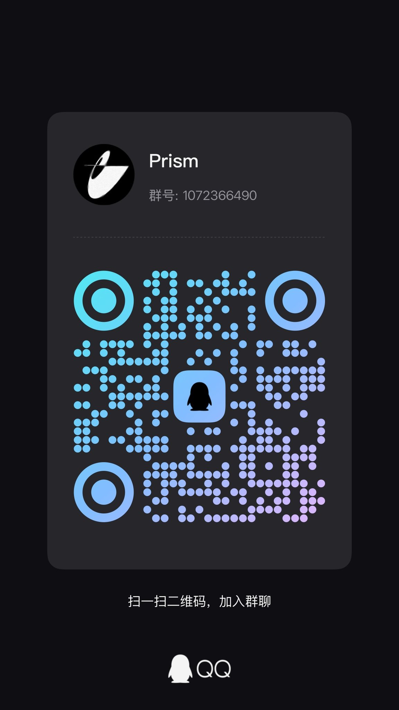

# Prism 棱镜/映射
> 创作一次，映射全平台。

Prism一个 AI 驱动的多平台内容编排与自动化发布系统；
面向多账号、多素材、多平台的内容分发场景，提供从计划生成、任务调度到执行监控与数据回收的全链路能力；

---

## 目录
- [项目定位](#项目定位)
- [核心能力（矩阵投放闭环）](#核心能力矩阵投放闭环)
- [新功能集成](#新功能集成)
- [功能](#功能)
- [支持平台](#支持平台)
- [架构概览](#架构概览)
- [部署开始](#部署开始)
  - [Windows 本地部署](#windows-本地部署)
  - [macOS（PM2）部署](#macospm2部署)
- [命令行](#命令行)
- [矩阵投放流程（SOP）](#矩阵投放流程sop)
- [API 示例](#api-示例)
- [目录结构](#目录结构)
- [合规提示](#合规提示)
- [项目支持与采用](#项目支持与采用)
- [许可](#许可)

---

## 项目定位

Prism 是一个“矩阵投放 / 分发中台”，把「账号、素材、计划、排期、执行、监控、回收」统一到可编排的任务系统中：
- 适合多平台、多账号的规模化分发与运营底座；
- 不强行覆盖剪辑/混剪/内容工厂，可作为外部生产链路的对接层；
- 设计参考行业常见“编-投-管-回”闭环，但项目更聚焦于“投 + 管 + 回”；

---

## 核心能力（矩阵投放闭环）

### 投：矩阵发布与调度
- 多平台、多账号、多素材组合发布；
- 批量生成任务、统一入队、并发调度；
- 定时发布、结果回传、失败重试；

### 管：账号与任务运营
- 账号绑定、状态监控、异常提醒；
- 任务队列看板、执行日志可视化；
- 每账号固定身份绑定（账号 → 浏览器身份 → 固定代理 → 浏览器执行）；

### 回：数据回收（复盘输入）
- 当前支持：抖音、B 站、TikTok、YouTube；
- 预留可扩展：快手、小红书、视频号等（按平台适配器扩展）；

### 编：AI 编排加速（投前准备）
- 内置 HermesAgent AiAgent 助手(装备Computeruse、各类mcp、skill、长记忆、多Agent）
- 自然语言生成/润色标题、标签、话题等投放配置；
- 支持“一句话投放”（示例见下）；

### 可扩展 / 可自托管
- FastAPI + Next.js + Celery/Redis + Patchright + Persona Studio；
- 平台适配器模块化扩展；
- Web 控制台 + Electron 桌面端，可本地或私有化部署；
- 浏览器身份层、代理层均可在「直连 / 内置后台 / 自托管」间按需开关；

---

## 新功能集成

> 最近一轮优化的核心是把“账号的**固定身份环境**”落成可编排、可切换、可一键维护的组件：
> **账号 → Persona 浏览器身份 → 固定代理 → Patchright 执行**，并补齐运行时管理、开发者工具中心与后台配置。

### 1) Persona Studio —— 浏览器身份 / 指纹 / Profile 层

集成 [Persona Studio](https://github.com/TechQaiser/persona-studio)（MIT，开源自托管反检测浏览器与 Profile 管理器）作为 Prism 的 **Browser Identity / Fingerprint / Profile 层**：

- **相干指纹生成**：OS / UA / GPU / 屏幕 / 时区 / 语言彼此一致，避免“macOS UA 配 NVIDIA GPU”这类一眼假组合；
- **Profile 持久化**：Cookie / LocalStorage / IndexedDB 随 Profile 留存，登录一次、下次启动仍在；
- **持久会话**：账号登录态跨任务复用，无需重复扫码；
- **引擎可选**：`cloak`(CloakBrowser) / `camoufox` / `patchright` / `playwright`（默认与 Prism 运行时一致的 `patchright`）；
- **代理注入 + 出口 IP / 泄漏检测**。

Prism **不自研**指纹、Profile 存储、指纹伪造，全部交给 Persona Studio；不安装时自动回退 **Patchright 直连模式**（每账号独立 `data/browser_profiles/<account>/` persistent context），功能不中断，仅少相干指纹/持久会话增强。

- 账号表 `cookie_accounts` 增加 `persona_profile_id`（默认 = account_id）、`browser_backend`（patchright / persona）、`proxy_id`；
- 一个 Prism 账号 ↔ 一个 Persona Profile；
- Persona serve：`http://127.0.0.1:8787`（`PERSONA_API_URL`）。

### 2) per-country 代理网关 + 每账号代理绑定

独立的官方 **mihomo** 网关（`tools/persona-studio/proxies/`）提供 **将订阅遍历映射为 HTTP/SOCKS mixed 端口，各路由到一个地区节点：
如：
| 地区 | 端口 | locale / 时区对齐 |
|---|---|---|
| 直连 | — | 本机网络 + 本机 locale/时区 |
| 🇸🇬 新加坡 (sg) | 7771 | en-SG / Asia/Singapore |
| 🇯🇵 日本 (jp) | 7772 | ja-JP / Asia/Tokyo |
| 🇺🇸 美国 (us) | 7773 | en-US / America/New_York |
| 🇩🇪 德国 (de) | 7774 | de-DE / Europe/Berlin |
| 🇹🇼 台湾 (tw) | 7775 | zh-TW / Asia/Taipei |
| 🇭🇰 香港 (hk) | 7776 | zh-HK / Asia/Hong_Kong |

- 账号通过 `GET/PUT /api/v1/accounts/{id}/persona-proxy` 绑定地区；
- 进程启动浏览器时，按绑定注入对应代理，并按 country 对齐 **locale / 时区 / 国家**，让指纹更真实；
- 未绑定地区（direct）或未勾选时，回退到 **IP 池代理**（Proxy Manager 的 sticky 绑定）。

### 3) 代理管理（Proxy Manager / IP 池）

Prism 自研的代理管理：
- 登记标准 HTTP/SOCKS5 endpoint，自动健康检测（延迟 / 可用性）；
- **sticky 固定绑定**：`proxy_id` 权威落账号表，同一账号始终走同一代理；
- 批量导入 / 导出、自动绑定（从空闲池按 region 匹配）、`max_bindings` 上限；
- 每账号环境视图（`GET /api/v1/accounts/{id}/environment`）：展示 Browser + Proxy + Runtime 状态。

> 3Proxy / gluetun / sing-box 等只产出标准 HTTP/SOCKS5 endpoint 登记进 Proxy Manager，不进入 Prism 核心业务。

### 4) 浏览器运行时管理（系统 Chrome / 无头 / 运行时切换）

设置页「浏览器管理」提供：
- **运行时检测**：Patchright 是否安装、当前采用哪种运行时；
- **浏览器资源**：Chromium / Firefox 的安装、卸载与版本识别，可一键 `patchright install`；
- **系统 Chrome 优先**：倾向于使用本机 Chrome，而非下载的 Chromium；
- **无头/有人头运行**：写入 `.env` 的 `PLAYWRIGHT_HEADLESS`，web 设置页可切换；
- **进程管理**：重启、停止与退出 Supervisord / PM2 管理的进程；
- **数据清理**：素材、账号与 Cookies、浏览器数据、缓存；
- **应急工具**：系统自检、日志导出、强制停止。

### 5) 开发者工具中心（一键安装 / 技能管理）

`/tools` 页面统一管理可一键安装的开发工具，按 **skill / MCP / 插件 / 组件** 分类：
- 已收录：`deepseek-harness`、`ccswitch`、`computer-use-linux`、`hermes-agent`、`persona-studio`；
- **一键安装 / 卸载**：克隆 + 构建（如 persona dashboard 构建）；
- **启动 / 调用**：已装桌面应用（如 CC Switch）可从 Prism 直接打开；
- **Hermes 技能软启用 / 停用**：技能（`SKILL.md`）在 `active` 与 `_disabled` 目录间移动，**不物理删除**；
- 后端：`GET /api/v1/tools`、`/{id}/install`、`/{id}/uninstall`、`/{id}/launch`、`/{id}/build`、`/{id}/toggle`。

### 6) CMS 隐藏后台

`/cms` 隐藏管理后台，集中控制运行开关（修改后需重启后端生效）：
- **抖音登录模式**：`browser`（正式 / 当前模拟）↔ `http`（逆向 HTTP 测试）；
- **浏览器后端**：`patchright` / `persona`；
- **无头模式**：`PLAYWRIGHT_HEADLESS`；
- 相关 `.env`：`PRISM_DOUYIN_LOGIN_MODE`、`PRISM_BROWSER_BACKEND_DEFAULT`。

### 7) 账号登录体验改进

- **二维码登录**：支持取消（停止连接/轮询）与重试；支持从本机 Chrome 导入已登录账号；
- **从本机 Chrome 导入**：复制本机 Chrome 的 Cookies/Local State 到 Prism 专用 profile（非无痕），无需关闭 Chrome，若平台已登录则直接读取登录态入库；
- **TikTok / YouTube**：恢复上游 SAU 交互式登录，修复 `--no-sandbox` 崩溃、cookie 抓取与账号入库（user_id 兜底 + account_id）；
- **Toast 自动关闭**：修复 Radix 暂停态导致通知不自动关闭的问题。

### 8) 每账号运行时锁

Redis 每账号 Browser Runtime 分布式锁（`runtime_lock_service`）：保证同一账号的浏览器任务串行执行，避免并发互踩；心跳续期，异常自动释放。

### 9) TikTok / YouTube 数据采集 + TikHub 账号信息自动回填

- **TikTok 视频数据采集**：通过 TikHub Web API 自动把账号数字 uid 解析为完整 secUid，拉取作品列表（视频 ID / 标题 / 封面 / 播放 / 点赞 / 评论 / 分享 / 收藏 / 发布时间），无需浏览器；
- **YouTube 视频数据采集**：通过 TikHub 频道 API 拉取频道视频列表（视频 ID / 标题 / 封面 / 播放 / 点赞 / 评论 / 时长）；
- **账号信息自动回填**：TikTok / YouTube 浏览器登录成功后，自动用 TikHub 反查账号真实资料（账号名 uniqueId、昵称、头像）并写回账号库，账号列表页直接显示真实名字和头像，无需手动补录；已有账号也可在账号列表点击「补全」手动触发反查（`POST /accounts/{id}/enrich-tikhub`）；
- **YouTube 频道注册解析**：添加 YouTube 账号时支持直接填频道名 / @handle / 频道链接，一键解析出 channel_id、频道名、头像并预填（`POST /accounts/resolve/youtube-channel`）；
- 依赖 TikHub API Key（`ai_model_configs` 表配置），充值后即可使用全部接口。

---

## 功能

### 1) 账号管理——登录账号
支持平台「抖音、快手、小红书、视频号、B 站」扫码登录；
「TikTok、YouTube」则是patchright调用本机浏览器登录后，账号自动入库并回源账号信息；

### 2) 素材管理——AI 标题/标签润色 + 批量上传
支持 AI 自动补全标题、标签，支持批量拖拽上传；

### 3) 多平台多账号同步发布
支持「抖音、快手、小红书、视频号、B 站」同步发布；支持 AI 一句话发布：
“帮我把素材库刚上传的视频，生成标题、标签并定时发布 23:55，发布到所有平台；”

### 4) 访问不同平台/账号的创作者后台
支持 每个账号有独立浏览器身份 + 固定代理，可访问对应创作者后台；

### 5) 视频数据回收与复盘
支持抖音、B 站、TikTok（本地部署API接口读取数据）
（YouTube、快手、小红书、视频号——支持付费 API 接口读取数据）；

### 🎬 产品演示视频（纯黑白）

**真实交互 Walkthrough**（登录弹窗 · 素材 · 矩阵发布 · 任务 · Agent 对话，Apple 质感包装）：


**14 页功能巡览**（仪表盘 / 账号管理 / 矩阵发布 / 数据 / Agent …，HyperFrames 合成）：


---

## 支持平台

内置平台适配器（可扩展）：
- 抖音
- 快手
- 小红书
- 视频号
- B 站
- TikTok（本机浏览器登录）
- YouTube（本机浏览器登录）

### 登录运行时状态

- 支持抖音、快手、小红书、视频号、B 站、Tiktok、Youtube 账号掉线检测；

---

## 架构概览

技术栈：FastAPI、Next.js、Celery/Redis、Patchright、Persona Studio、Electron、mihomo（代理网关）；

```text
prism_frontend/    # Next.js 控制台（计划/任务/看板/工具/CMS）
prism_backend/     # FastAPI 后端（矩阵调度 + AI 服务 + 账号/代理/运行时）
scripts/           # 启动与运维脚本
desktop-electron/  # Electron 客户端与打包
tools/             # 自托管组件（hermes-agent / hermes-webui / persona-studio）
```

职责边界：

| 层 | 归属 |
|---|---|
| 账号 / 平台 / 任务 / Celery / Redis | Prism |
| 代理网关（per-country 端口 7771–7776） | mihomo（Persona proxies） |
| Proxy Manager（proxies、sticky 绑定、健康检测） | Prism |
| Browser Identity / Fingerprint / Profile | Persona Studio |
| 浏览器执行（平台 Adapter 驱动） | Prism Patchright（`connect_over_cdp`） |

固定链路：

```text
Account
  → persona_profile_id（Prism 账号表）
  → Persona Profile（指纹 + 持久会话）
  → Sticky Proxy（Proxy Manager 注入 / per-country 代理）
  → Patchright（connect_over_cdp 驱动）
  → Platform Adapter（发布 / 登录 / 数据回收）
```

---

## 部署开始

### Windows 本地部署

采用本地部署：适合开发、调试，可单独查看 Redis / Celery / Automation Worker / FastAPI / HermesAgent 的运行状态。

#### 1) 安装依赖

方式 A：`prismenv`（默认推荐）

```powershell
python -m venv prismenv
prismenv\Scripts\activate
pip install -r requirements.txt

cd prism_frontend
npm install
cd ..
```

也可以直接运行 `start.bat`。它会优先检测 `prismenv`，不存在时自动创建并安装根 `requirements.txt`。

方式 B：`conda`

```powershell
conda create -n prism python=3.11.4
conda activate prism

pip install -r requirements.txt
cd prism_frontend
npm install
cd ..
```

#### 2) 配置环境

必须检查两类配置：

- 根目录 `.env`：端口、Redis、浏览器路径、前后端连接地址、`PLAYWRIGHT_HEADLESS`、`PRISM_BROWSER_BACKEND_DEFAULT`、`PRISM_DOUYIN_LOGIN_MODE`。
- `prism_backend\config\hermes_agent.toml`：HermesAgent 的 provider / model / api_key / base_url。

浏览器依赖：

```powershell
scripts\launchers\setup_browser.bat
```

桌面版支持在“系统设置”页管理 `Chromium` / `Firefox`；所有平台自动化统一由 `Patchright` 执行。

#### 3) 启动方式

方式 A：一键拉起完整本地栈

```powershell
start.bat
```

等价于默认 `prismenv` 模式，会按顺序启动：

1. Redis
2. Celery Worker
3. Automation Worker
4. FastAPI Backend
5. Frontend

重要说明：

- 本地后端进程缺一不可。少起任意一个进程，前端页面可能能打开，但任务调度、浏览器执行、异步回调、HermesAgent 调用链都会不完整。
- HermesAgent Dashboard / WebUI 由 FastAPI 在非 Supervisor 模式下自动托管；前提是 `prism_backend\config\hermes_agent.toml` 已正确配置，且本地 Hermes 运行时已通过 `scripts\hermes\setup-local-hermes.ps1` 安装完成。

方式 B：Supervisor 模式

```powershell
start.bat supervisor
```

该模式会启动：

- Redis
- Supervisor
- Frontend

再由 Supervisor 托管：

- FastAPI Backend
- Celery Worker
- Automation Worker
- HermesAgent 相关界面与网关

方式 C：手动逐个进程启动（仅调试时使用）

```powershell
scripts\launchers\start_redis.bat
scripts\launchers\start_celery_prismenv.bat
scripts\launchers\start_worker_prismenv.bat
scripts\launchers\start_backend_prismenv.bat
scripts\launchers\start_frontend.bat
```

#### 4) Windows 访问地址

- 控制台：http://localhost:3000
- 后端 API：http://localhost:7000/api/docs
- Automation Worker：http://localhost:7001
- Supervisor API：http://localhost:7002（仅 `start.bat supervisor`）
- Persona serve：http://localhost:8787
- per-country 代理网关：http://localhost:7771-7776
- HermesAgent Dashboard：http://localhost:9119
- HermesAgent WebUI：http://localhost:9131

---

### macOS（PM2）部署

macOS 推荐用 **PM2** 统一管理全套进程，避免 nohup 多进程难维护的问题：

```bash
./start-pm2.sh
```

`ecosystem-mac.config.js` 会拉起：

| 进程 | 说明 | 地址 |
|---|---|---|
| `prism-backend` | FastAPI 后端（run.py，使用 `.venv` python） | http://127.0.0.1:7000 |
| `prism-worker` | Automation Worker | http://127.0.0.1:7001 |
| `prism-celery` | Celery Worker（threads pool） | Redis |
| `prism-frontend` | Next.js 控制台 | http://localhost:3000 |
| `persona-api` | Persona serve（`persona --data-dir ... serve`） | http://127.0.0.1:8787 |
| `persona-proxy` | 独立官方 mihomo 网关 | http://127.0.0.1:7771-7776 |

> `start-pm2.sh` 会先清理残留进程避免端口占用，再启动并打印 `pm2 list`。
> `ecosystem-mac.config.js` 显式设置 `PRISM_BROWSER_BACKEND_DEFAULT=persona`，即 macOS 默认走 Persona 身份层。

常用命令：

```bash
PM2_HOME=./runtime-data/pm2 ./prism_frontend/node_modules/.bin/pm2 logs
PM2_HOME=./runtime-data/pm2 ./prism_frontend/node_modules/.bin/pm2 restart all
PM2_HOME=./runtime-data/pm2 ./prism_frontend/node_modules/.bin/pm2 stop all
```

也可以使用 `start-mac.sh`（nohup 拉起 Redis + Backend + Worker + Celery + Frontend，等价 Windows 的 `start.bat`）：

```bash
./start-mac.sh
```

macOS 访问地址与 Windows 相同（见上）。

---

## 命令行

安装项目后可以直接使用 `prism` 命令。CLI 与 Web、桌面端共用同一套平台适配器、账号文件和 Patchright 运行时：

```bash
pip install -e .

prism douyin login --account creator
prism douyin check --account creator
prism douyin upload-video \
  --account creator \
  --file ./video.mp4 \
  --title "示例标题" \
  --description "示例简介" \
  --tags "Prism,自动发布"
```

定时发布使用本地时间，格式为 `YYYY-MM-DD HH:MM`：

```bash
prism xiaohongshu upload-video \
  --account creator \
  --file ./video.mp4 \
  --title "示例标题" \
  --schedule "2026-08-18 20:30"
```

国际平台首次使用需在运行 Prism 的本机浏览器中完成账号登录；登录态会以 storage state 保存并供任务队列复用：

```bash
prism tiktok login --account creator
prism youtube login --account creator
prism youtube upload-video --account creator --file ./video.mp4 --title "Example" \
  --description "Video description" --tags "Prism,automation" --visibility unlisted
```

### Gemini Computer Use 受控恢复（可选）

Gemini Computer Use 仅用于在 Patchright 定位失败时收集截图与候选动作，辅助生成可审查的平台适配器代码补丁；
它不在正式发布任务中执行点击、填写或提交。正式发布始终使用版本化、可测试的 Patchright 平台适配器。

---

## 矩阵投放流程（SOP）

1. 绑定账号（多平台账号矩阵，可绑定浏览器身份 + 固定代理 + per-country 代理地区）；
2. 素材入库（批量上传 / AI 标题标签润色）；
3. 创建矩阵计划（平台、账号、素材、话题、封面、定时策略）；
4. 生成矩阵任务并调度执行（队列化、并发、失败重试、每账号运行时锁）；
5. 看板监控与日志审计（异常提醒 / 人工介入点）；
6. 数据回收（抖音、B 站）并复盘迭代；

---

## API 示例

生成矩阵任务：

```http
POST /api/v1/matrix/generate_tasks
Content-Type: application/json
```

```json
{
  "platforms": ["xiaohongshu", "douyin"],
  "accounts": {
    "xiaohongshu": ["account_id_1", "account_id_2"],
    "douyin": ["account_id_3"]
  },
  "materials": ["material_id_1", "material_id_2"],
  "title": "xxxxx",
  "topics": ["#xxx", "#xxx"]
}
```

账号固定身份绑定（Persona 代理地区）：

```http
GET  /api/v1/accounts/{account_id}/persona-proxy   # 读取绑定地区 + 可用地区列表
PUT  /api/v1/accounts/{account_id}/persona-proxy   # 设置地区（direct/sg/jp/us/de/tw/hk）
```

账号环境视图：

```http
GET /api/v1/accounts/{account_id}/environment
```

开发者工具：

```http
GET  /api/v1/tools                      # 工具目录（skill/mcp/plugin/component）
POST /api/v1/tools/{tool_id}/install    # 一键安装
POST /api/v1/tools/{tool_id}/uninstall  # 卸载
POST /api/v1/tools/{tool_id}/launch     # 打开本地应用
POST /api/v1/tools/{tool_id}/build      # 构建（如 Persona dashboard）
POST /api/v1/tools/{tool_id}/toggle     # 软启用/停用技能
```

---

## 目录结构

- `prism_backend/fastapi_app`：API、矩阵调度、任务队列与服务逻辑；
- `prism_frontend/`：矩阵投放控制台（Next.js，含 `/tools`、`/cms`）；
- `desktop-electron/`：桌面客户端与打包脚本；
- `scripts/`：启动、调试、维护脚本；
- `tools/`：自托管组件（`hermes-agent` / `hermes-webui` / `persona-studio` 及 `proxies` 代理网关）；
- `runtime-data/`：运行时数据（PM2 的 `pm2` 目录、Hermes 技能等）；
- `scripts/tests/`：手动与集成验证脚本（原 `Test/` 目录已收纳至此）；
---

## 合规提示

本项目用于自动化流程与效率提升，请在合法合规、遵守平台规则的前提下使用；
涉及账号体系与内容发布的规模化运营，建议建立团队内部内容审核与风险控制流程；

---

## 项目支持与采用

Prism 的能力建设受益于开源生态；下列项目的代码、架构或实现思路被采用、移植或作为实现参考：

- [social-auto-upload](https://github.com/dreammis/social-auto-upload)：上游 CLI 自动发布基础；MIT License。
- [Douyin_TikTok_Download_API](https://github.com/Evil0ctal/Douyin_TikTok_Download_API)：抖音 / TikTok 解析与数据能力参考；Apache License 2.0。
- [HermesAgent](https://github.com/nousresearch/hermes-agent)：本地 AI Agent 运行时与集成参考；MIT License。
- [Persona Studio](https://github.com/TechQaiser/persona-studio)：浏览器身份 / 指纹 / Profile 层；MIT License。

对应第三方归属和许可证说明保留在 [NOTICE.txt](NOTICE.txt)。

---

## 许可
Prism 自身代码基于 Apache License 2.0 开源。项目中保留的 MIT 与 Apache-2.0 上游组件继续分别适用其原始许可证；Apache-2.0 与 MIT 组件可共同分发，但必须保留上游版权、许可证和 NOTICE 归属。

## Community

本项目在 [LINUX DO](https://linux.do/) 社区进行交流与开源推广。

感谢 LINUX DO 社区为开发者提供交流与分享的平台。

## [BuymeaCoffee](https://buymeacoffee.com/laihiujin3)

| | | |
|-|-|-|
|  |  |  |
