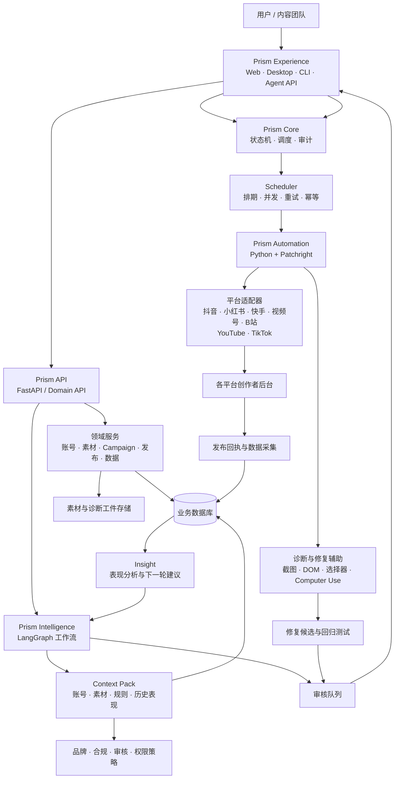
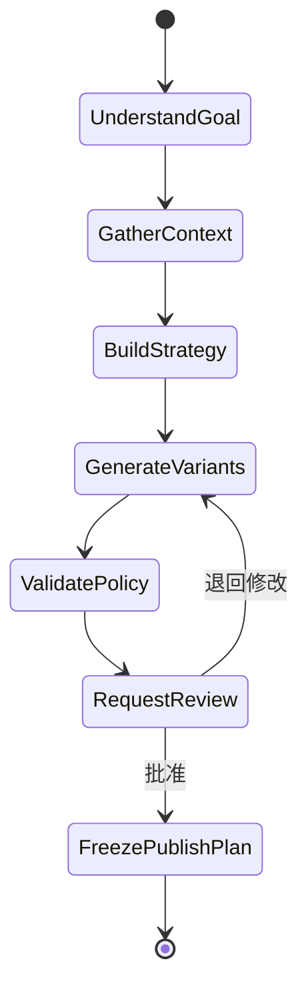
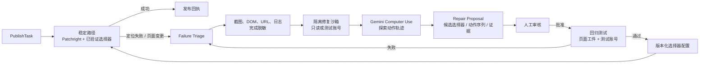
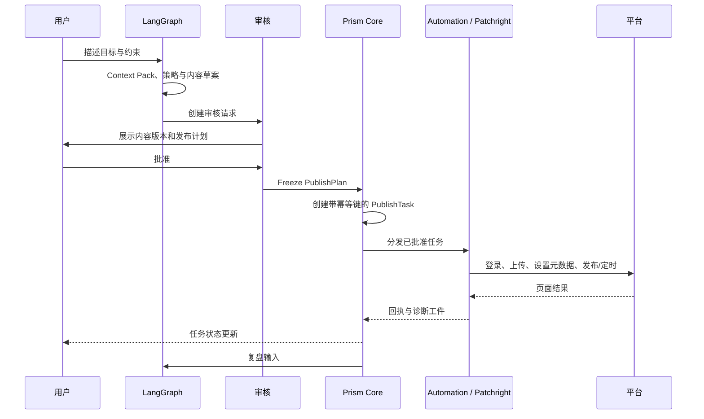

# Prism 目标总体架构设计

> 状态：预开发架构。
>
> 目标：在保留已验证发布能力的前提下，将 Prism 演进为可审核、可恢复、可诊断的 AI 内容分发系统。
>
> 原则：**AI 负责理解和建议；Prism Core 负责确定性执行；Patchright 负责真实浏览器操作。**

## 1. 当前基线

当前 Prism 已有账号、素材、计划、任务队列、FastAPI、Celery/Redis、Web 控制台、Electron 桌面端及 Python 浏览器自动化。运行目录正在收敛为：

```text
prism_backend/     FastAPI、业务服务、平台上传器、自动化 Worker
prism_frontend/    Next.js 控制台
desktop-electron/  当前桌面壳与服务管理
scripts/           运维、打包和启动脚本
```

当前问题不在于缺少模型，而在于 AI、平台自动化和任务系统尚未由同一套业务对象连接：

- AI 助手尚未覆盖 Campaign、内容版本、审核、发布计划和复盘；
- 页面变更后的诊断、修复、验证没有标准闭环；
- CLI、Web 和桌面端的业务命令尚未完全统一；
- YouTube、TikTok 等上游已有能力尚未收敛为 Prism Adapter；
- Electron、多服务和批处理脚本仍有轻量化空间。

## 2. 目标架构



产品主路径：

```text
自动化发布 → Campaign Copilot → AI 内容分发工作流 → 内容运营操作系统
```

## 3. 双工作流

| 工作流 | 推荐实现 | 负责 | 不负责 |
| --- | --- | --- | --- |
| AI 工作流 | LangGraph | 理解目标、收集上下文、策略和内容草案、风险检查、等待审核、复盘 | 定时、并发、可靠重试、真实发布 |
| 执行业务工作流 | Celery/Redis；后续 Rust 状态机 | 排期、幂等、任务分发、重试、状态、回执、恢复 | 自由推理与无约束决策 |
| 浏览器自动化 | Python + Patchright | 登录、上传、页面操作、截图与诊断 | Campaign 决策、审核、全局调度 |

架构边界：**LangGraph 不直接发布；Patchright 不决定业务策略；调度器不依赖模型的自然语言输出。**

## 4. 领域模型

```text
Workspace
├── Brand：BrandVoice、CompliancePolicy、PlatformGuidelines
├── Account：Platform、Capabilities、Health、PublishingLimits
├── Asset：Video/Image/Text、Transcript、Topic、Rights、AI metadata
├── Campaign：Goal、Audience、Strategy、SchedulePolicy、ReviewPolicy
├── ContentVariant：各平台标题、正文、标签、封面、格式
├── PublishPlan：Variant × Account × Platform × Schedule
├── PublishTask：幂等键、执行状态、重试状态、回执
├── Review：决策、意见、批准人、版本、时间
└── Insight：表现、异常、模式与下一轮建议
```

建议逐步建立：

```text
campaigns                 campaign_strategies
content_items             content_variants
publish_plans             publish_tasks
publish_receipts          task_events
review_requests           review_decisions
account_health_snapshots  platform_constraints
metric_snapshots          insights
agent_runs                agent_checkpoints
audit_events              automation_diagnostics
selector_candidates       repair_proposals
```

关键关系：

```text
Campaign 1 ── N ContentVariant
Campaign 1 ── N PublishPlan
PublishPlan 1 ── N PublishTask
PublishTask 1 ── N TaskEvent
PublishTask 1 ── 1 PublishReceipt
Campaign 1 ── N Review / Insight
```

## 5. Prism Intelligence：LangGraph

LangGraph 用于 AI 工作流的结构化状态、分支、暂停和恢复，不替代后端队列。

| Agent | 输入 | 输出 | 默认权限 |
| --- | --- | --- | --- |
| Strategist | 目标、账号、历史表现 | Campaign 策略草案 | Read + Draft |
| Composer | 素材、品牌语气、平台规则 | 多平台内容版本 | Read + Draft |
| Reviewer | 草案、重复度、合规规则 | 风险报告和修改建议 | Read + Draft |
| Analyst | 发布回执、内容指标 | 复盘和下一轮建议 | Read + Draft |
| Executor | 已批准 PublishPlan | 创建执行请求 | 受策略控制的 Execute |



每次运行保存 `agent_run_id`、模型和 Prompt 版本、工具调用摘要、输入数据版本和 checkpoint。AI 默认只能读取数据或写入草案；审批、排期、发布、取消等副作用必须穿过权限策略。

每次调用由领域服务生成 Context Pack，而不是拼接整库数据：

```text
目标与约束
品牌语气、禁用词、审核规则
账号健康状态与平台能力矩阵
素材元数据、转录、视觉摘要、版权状态
最近发布内容及重复度
历史表现、推荐时间与异常
当前草案、审核意见与版本差异
```

## 6. 平台扩展与 Adapter Contract

`social-auto-upload` 的 YouTube、TikTok 与 CLI 能力应以“平台能力补充”进入 Prism，而不是复制其独立 Web 或运行架构。接入前确认许可证、文件来源和改动记录。

| 平台 | 当前 Prism 重点 | 上游补充目标 | 验收 |
| --- | --- | --- | --- |
| 抖音 | 上传、矩阵调度、账号管理 | CLI 参数与无头稳定性 | 登录、发布、定时、失败截图 |
| 小红书 | 上传、内容适配 | 图文 CLI、账号检查 | 登录、图文/视频、回执 |
| 快手 | 上传适配 | CLI、图文、检查 | 登录、图文/视频、回执 |
| 视频号 | 上传适配 | CLI 统一入口与会话检查 | 登录、视频、定时 |
| B 站 | 上传、数据回收 | CLI、biliup 封装 | 登录、视频、回执 |
| YouTube | 待补齐 | storage state、视频、播放列表、可见性、代理 | 登录、公开视频/非公开、播放列表 |
| TikTok | 待补齐 | 浏览器适配、代理、账号会话 | 登录、视频、定时评估、诊断工件 |

所有平台实现相同契约：

```text
prepare_session()
validate_account()
validate_payload()
upload_media()
apply_platform_metadata()
schedule_or_publish()
verify_receipt()
capture_diagnostics()
```

回执必须结构化：

```json
{
  "task_id": "pub_123",
  "status": "succeeded",
  "platform": "youtube",
  "platform_post_id": "video_id",
  "published_at": "2026-08-18T10:30:26+08:00",
  "artifact_paths": {"screenshot": "artifacts/pub_123/success.png"}
}
```

失败结果必须带 `error_code`、`retryable`、`requires_human_action` 和诊断工件路径，而不是只返回异常字符串。

## 7. CLI 设计

CLI 是 Domain API 的正式客户端，不应绕过业务层直接调用上传脚本。

```text
prism account login --platform youtube --account brand_main
prism account check --platform tiktok --account brand_main --json
prism publish video --platform youtube --account brand_main --file demo.mp4 \
  --title "标题" --description "描述" --tags a,b --visibility public
prism campaign create --from campaign.yaml
prism campaign validate cmp_123
prism campaign approve cmp_123
prism task status pub_123 --json
prism diagnose platform youtube --account brand_main
```

规则：

- 所有命令支持 `--json`，并产出 `request_id` 与审计事件；
- `publish` 默认创建待审核计划；只有显式授权或策略许可时才直接排期；
- Web、CLI、Agent 共用 Domain Service 与发布契约；
- 初期可用 Python，后续由 `prism-core` 的 Rust 二进制接管，但命令语义不改变。

## 8. Google Computer Use：受控诊断与修复辅助

Google 的 Gemini Computer Use 是 API 能力，不是一个安装即可“自动修复点击发布”的现成 MCP。模型根据截图提出点击、输入、滚动等动作；客户端负责执行并回传新截图。官方建议在隔离环境运行，对重要操作密切监督，并将该能力视为预览功能。[Gemini Computer Use 官方文档](https://ai.google.dev/gemini-api/docs/computer-use?authuser=4)

正确集成是：在 Prism 中实现 Local MCP Tool Adapter，将 Computer Use 限制为页面变更的诊断、探索、动作轨迹和修复建议工具；它不替代 Patchright，也不是生产发布器。



生产路径始终是：

```text
已验证选择器 + Patchright + 平台 Adapter + 结构化验证
```

Computer Use 仅在原选择器失效、页面出现未知引导/弹窗、测试需要探索新流程或开发者需要诊断证据时启用。

### 8.1 禁止行为

Computer Use Agent 不得：

- 在生产账号上自行点击最终“发布”、删除、支付等不可逆操作；
- 绕过验证码、风控、人机验证或平台安全机制；
- 读取或外传完整 Cookie、密码、私信、个人信息、密钥和未脱敏截图；
- 未经审核写入生产选择器配置或代码；
- 因模型建议改变 Campaign 内容、发布时间或目标账号。

### 8.2 本地 MCP 工具

```text
diagnose_automation_failure(task_id)
open_repair_sandbox(platform, fixture_or_test_account)
request_computer_use_trace(repair_session_id, goal)
create_repair_proposal(repair_session_id)
run_selector_regression(proposal_id)
submit_repair_for_review(proposal_id)
```

不暴露无审核的 `publish_now`、`bypass_verification` 或 `apply_selector_patch`。

### 8.3 修复工件与版本化

每次诊断需要保存：平台、Adapter/运行时版本、脱敏截图和 DOM、失败选择器、Computer Use 动作轨迹与安全决策、修复提案、审核结论、回归结果、选择器版本。

选择器应从 Python 硬编码逐步迁移为版本化配置：

```text
prism_backend/config/selectors/
  douyin_upload.v1.json
  xiaohongshu_upload.v3.json
  youtube_upload.v1.json
  tiktok_upload.v1.json
```

稳定闭环是：**模型发现变化 → 人工批准 → 自动回归验证 → 发布版本化配置**，而不是模型在线修改生产代码。

## 9. 发布时序、状态与权限



```text
draft → awaiting_review → approved → scheduled → queued → running
      → succeeded | failed_retryable | failed_final | cancelled
```

AI 默认仅有 Read + Draft。审核角色才能批准计划；Prism Core 只能对批准的不可变计划创建任务；Automation Worker 仅拿到任务令牌与必要的平台授权。每个任务必须有幂等键，例如：

```text
campaign:cmp_123:variant:v_02:account:youtube_brand_main
```

## 10. Rust 轻量化定位

Rust 不重写浏览器适配器。它用于产品运行骨架：

```text
Prism Desktop（Tauri）
        ↓ IPC / localhost HTTP
prism-core（Rust daemon）
        ├── 生命周期与端口管理
        ├── 任务状态机与本地调度
        ├── CLI、日志、健康检查
        └── runtime.db
        ↓ HTTP / stdio
prism-api 与 prism-automation（Python + Patchright）
```

前提是先稳定 Domain API、自动化回执和任务状态机；否则过早迁到 Rust 只会放大现有脚本复杂度。

## 11. 分期实施

### Phase 0：基础稳定化

- 完成 Prism 命名、目录、环境变量和桌面标识迁移；
- 统一 Patchright 为生产自动化运行时；
- 统一 Adapter Contract、诊断工件和回执；
- 建立稳定的 `prism` CLI 和 `--json` 输出；
- 为现有平台补充登录、发布、定时和失败工件冒烟测试。

### Phase 1：平台与 CLI 扩展

- 从 `social-auto-upload` 有选择地接入 YouTube、TikTok；
- 补齐现有平台 CLI；
- 将所有命令接入 Domain Service 和任务状态机；
- 建立平台能力矩阵、测试账号与回归用例。

### Phase 2：Campaign 与审核

- 落地 Campaign、ContentVariant、PublishPlan、Review、Insight；
- 建立 Campaign 工作台；
- 发布从“脚本直接执行”转换为“草案—审核—冻结—执行”。

### Phase 3：LangGraph Intelligence

- 实现 Strategist、Composer、Reviewer、Analyst；
- 工具按 Read / Draft / Execute 分级；
- 接入 checkpoint、审计与模型/Prompt 版本记录；
- 先交付 Campaign Copilot，不交付无约束万能 Agent。

### Phase 4：Computer Use Repair Lab

- 建立隔离浏览器沙箱和脱敏诊断工件；
- 接入 Gemini Computer Use 动作轨迹；
- 只输出候选修复；
- 经人工审核、回归通过后再版本化选择器配置。

### Phase 5：Rust Core 与 Tauri

- 用 `prism-core` 接管 Supervisor、健康检查、CLI 和本地运行状态；
- 以 Tauri 逐步替换 Electron；
- 影子验证 Rust Scheduler，再渐进替换 Celery 的发布调度职责。

## 12. 验收与安全底线

每个平台至少通过：登录和会话保存、账号检查、声明范围内的图文/视频与定时能力、可验证成功回执、结构化失败信息、诊断工件、CLI/Web/API 同一契约、固定回归用例和真实测试账号冒烟用例。

Computer Use 修复流程至少通过：隔离环境或测试账号、Cookie/密钥/个人信息脱敏、人工审核、回归通过后再发布、可版本回滚、绝不绕过验证码或风控。

## 13. 官方参考

- [Gemini Computer Use（Gemini API）](https://ai.google.dev/gemini-api/docs/computer-use?authuser=4)
- [Google Cloud Computer Use 安全与预览说明](https://docs.cloud.google.com/gemini-enterprise-agent-platform/models/computer-use?authuser=0)
- [Google Cloud MCP Servers 概览](https://docs.cloud.google.com/mcp/overview?authuser=1)
